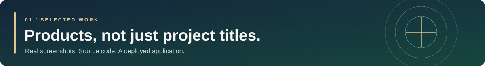
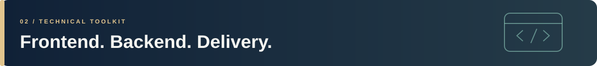

 

 

### Hi, I'm Adham.

I'm a Computer Science graduate and **Full-Stack Developer** based in Amman, Jordan. I build and deploy web applications using **React / Next.js**, **Node.js / Express**, and **ASP.NET Core**. My strongest interest is backend development: designing APIs, managing data and building reliable application workflows.

 

<table>
<tr>
<td width="53%" valign="top">

</td>
<td width="47%" valign="top">
<h3>01 — <a href="https://www.aoun.website/">Aoun</a></h3>

<strong>Deployed full-stack MVP · Arabic in-kind donations</strong>

Coordinates donation listings, need requests, booking and waitlists, messaging, and handover workflows across user roles.

<strong>Built with</strong> Next.js · TypeScript · Node.js · Express · MongoDB · Redis · Socket.IO

<a href="https://www.aoun.website/">Live application ↗</a> <a href="https://github.com/abuhager/Aoun-Project_FrontEnd">Frontend source ↗</a> <a href="https://github.com/abuhager/Aoun-Project_BackEnd">Backend source &amp; architecture ↗</a>

</td>
</tr>
</table>

<table>
<tr>
<td width="53%" valign="top">

</td>
<td width="47%" valign="top">
<h3>02 — <a href="https://github.com/abuhager/privateevent">UniEvents</a></h3>

<strong>University event booking · ASP.NET Core MVC</strong>

Student and admin workflows with capacity-aware reservations, FIFO waitlists, PDF tickets, attendance check-in, and Excel exports.

<strong>Built with</strong> C# · ASP.NET Core MVC · Razor · Entity Framework Core · SQL Server

<a href="https://github.com/abuhager/privateevent">Source, screenshots &amp; walkthrough ↗</a>

</td>
</tr>
</table>

 

 

**FRONTEND** 

 

**BACKEND &amp; DATA** 

 

**WORKFLOW** 

Also used in my work: SQL Server · Entity Framework Core · Mongoose · REST APIs · Socket.IO · Playwright · GitHub Actions · Render

---

**Experience:** Software Development Trainee (.NET), Quark Software · Oct 2025 – Jan 2026  
**Education:** B.Sc. Computer Science, Al-Zaytoonah University of Jordan · 2022 – 2026

### Let's build something useful.

[**See my portfolio**](https://www.adhamabuhagerdev.site/) · [**Browse repositories**](https://github.com/abuhager?tab=repositories) · [**Contact me**](mailto:abuhager360@gmail.com)

