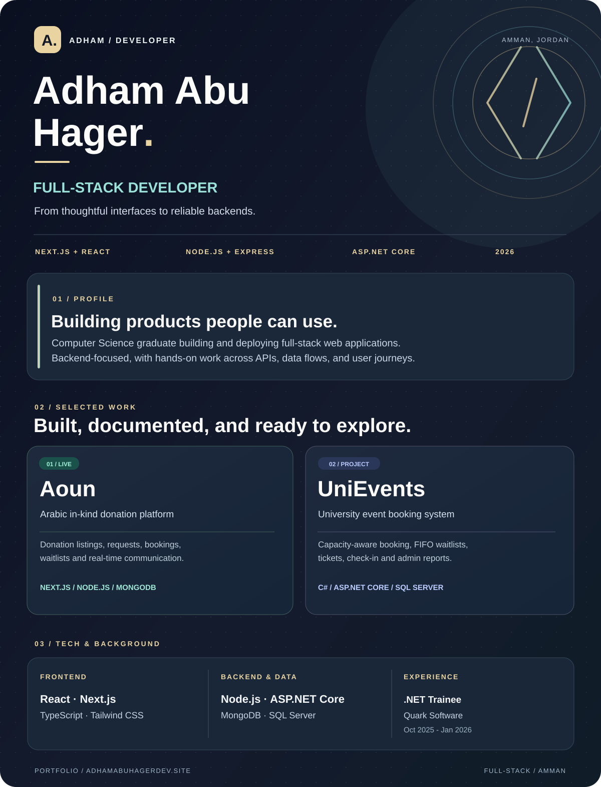

 

### Explore the projects

 

**[Aoun — In-kind Donation Platform](https://www.aoun.website/):** A deployed Arabic-language MVP with donation listings, needs requests, booking and waitlists, real-time communication, and handover coordination. [Frontend source](https://github.com/abuhager/Aoun-Project_FrontEnd) · [Backend source and architecture](https://github.com/abuhager/Aoun-Project_BackEnd) · [Live platform](https://www.aoun.website/).

**[UniEvents — University Event Booking](https://github.com/abuhager/privateevent):** ASP.NET Core MVC app with capacity-aware reservations, FIFO waitlists, PDF tickets, attendance check-in, and Excel exports. The screenshot uses its documented demo dataset. [Source code and walkthrough](https://github.com/abuhager/privateevent).

**Background:** Software Development Trainee (.NET), Quark Software (Oct 2025–Jan 2026) · B.Sc. in Computer Science, Al-Zaytoonah University of Jordan (2022–2026).

[**See more work and get in touch →**](https://www.adhamabuhagerdev.site/)

