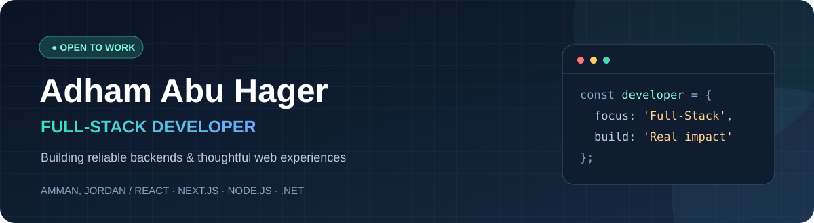

**Full-Stack Developer · Backend-focused · Amman, Jordan**

## What I work with

**Frontend** 

**Backend & data** 

**Tools** 

Also used: **SQL Server · Entity Framework Core · Mongoose · Socket.IO · Playwright · GitHub Actions · Render**.

## Selected projects

### [Aoun — In-kind Donation Platform](https://www.aoun.website/)

A deployed Arabic-language MVP that coordinates in-kind donation listings, need requests, booking and waitlists, messaging, and handover workflows. **Stack:** Next.js, TypeScript, Node.js, Express, MongoDB, Redis, Socket.IO.

[Live platform](https://www.aoun.website/) · [Frontend source](https://github.com/abuhager/Aoun-Project_FrontEnd) · [Backend source and architecture](https://github.com/abuhager/Aoun-Project_BackEnd)

### [UniEvents — University Event Booking](https://github.com/abuhager/privateevent)

An ASP.NET Core MVC application with capacity-aware reservations, FIFO waitlists, PDF tickets, attendance check-in, and Excel exports. **Stack:** C#, ASP.NET Core MVC, Razor, Entity Framework Core, SQL Server.

[Source code and project walkthrough](https://github.com/abuhager/privateevent)

---

**Experience:** Software Development Trainee (.NET), Quark Software · Oct 2025–Jan 2026  
**Education:** B.Sc. Computer Science, Al-Zaytoonah University of Jordan · 2022–2026

[**Explore my portfolio →**](https://www.adhamabuhagerdev.site/) · [**Contact me →**](mailto:abuhager360@gmail.com)

